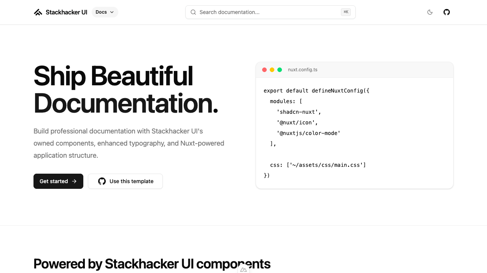

# Stackhacker UI Docs Template

[](https://ui.stackhacker.io)

Use this template to build documentation sites with [Stackhacker UI](https://ui.stackhacker.io), Nuxt 4, shadcn-vue, and Tailwind CSS v4.

- [Live demo](https://docs-template.stackhacker.io/)
- [Documentation](https://ui.stackhacker.io/docs/getting-started)

<a href="https://docs-template.stackhacker.io/" target="_blank">
  <picture>
    <source media="(prefers-color-scheme: dark)" srcset="public/screenshots/docs-dark.png">
    <source media="(prefers-color-scheme: light)" srcset="public/screenshots/docs-light.png">
    
  </picture>
</a>

## Quick Start

```bash [Terminal]
pnpm dlx nuxi@latest init my-docs -t gh:stackhacker-ui/docs
cd my-docs
pnpm install
pnpm dev
```

## Setup

Make sure to install the dependencies:

```bash
pnpm install
```

This template is verified with Node.js 22 and pnpm 10.

Set `NUXT_PUBLIC_SITE_URL` in production if you want social previews to use your own deployed URL.

## Development Server

Start the development server on `http://localhost:3000`:

```bash
pnpm dev
```

## Production

Build the application for production:

```bash
pnpm build
```

Locally preview production build:

```bash
pnpm preview
```

Check out the [deployment documentation](https://nuxt.com/docs/getting-started/deployment) for more information.

## Quality checks

Run the same checks as CI:

```bash
pnpm lint
pnpm typecheck
pnpm build
```

## Renovate integration

Install [Renovate GitHub app](https://github.com/apps/renovate/installations/select_target) on your repository and you are good to go.
